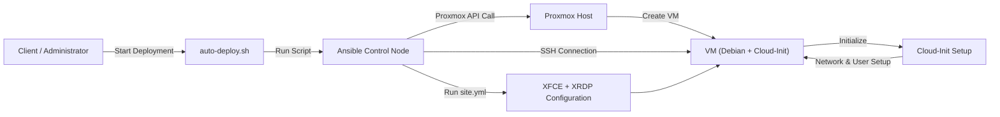
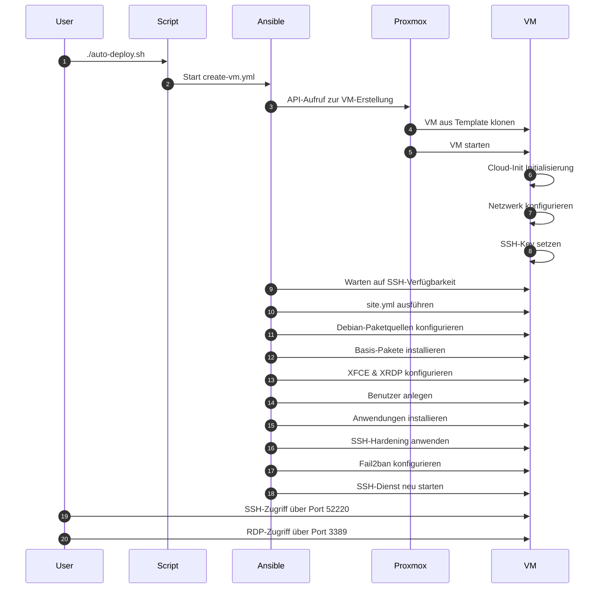
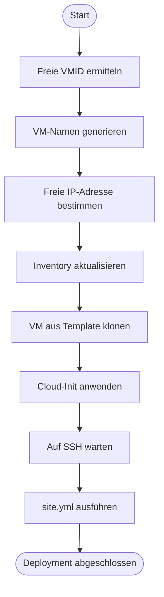
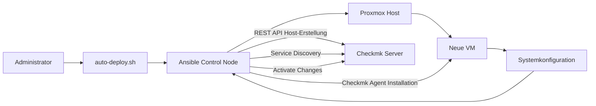

# **Automatisierung von virtuellen Maschinen mit Proxmox und Ansible**

----------

# **1. Einleitung**

Im Rahmen dieser Aufgabe wurde eine Lösung zur automatisierten Erstellung und Konfiguration von virtuellen Maschinen (VMs) entwickelt.

Die Umsetzung basiert auf den Technologien **Proxmox**, **Ansible**, **Cloud-Init** sowie **Shell-Skripten**. Ziel ist es, den gesamten Prozess – von der Erstellung bis zur fertigen Desktop-Umgebung – vollständig zu automatisieren.

Dies ermöglicht:

-   eine erhebliche Zeitersparnis
-   eine Reduzierung von Fehlern
-   eine standardisierte und reproduzierbare Infrastruktur

----------

# **2. Aufgabeziel**

Die wichtigsten Ziele der Augabe sind:

-   Automatisierte Erstellung von virtuellen Maschinen
-   Automatische Konfiguration von Desktop-Systemen (XFCE, XRDP)
-   Bereitstellung sofort einsatzbereiter Systeme
-   Minimierung manueller Eingriffe

# **3. Systemübersicht**

Die folgende Abbildung zeigt den automatisierten Ablauf des Systems:


**Abbildung 1: Gesamtübersicht des Systems**

Die Darstellung verdeutlicht den vollständigen Ablauf von der Erstellung bis zur Konfiguration der virtuellen Maschine.

----------

# **4. Ablauf des automatisierten Deployments**

**Abbildung 2: Ablauf des Deployments**

----------

# **5. Automatisierungslogik**

**Abbildung 3: Automatisierungslogik**

----------


# **6. Verwendete Dateien und deren Inhalt**

----------

## **6.1 Skript `auto-deploy.sh`**

Dieses Skript übernimmt die zentrale Steuerung des Deployments. Es ermittelt automatisch eine freie VMID sowie eine verfügbare IP-Adresse und startet anschließend das Hauptskript.

----------

## **6.2 Skript `full-deploy.sh`**

Dieses Skript führt die vollständige Erstellung und Konfiguration der virtuellen Maschine aus. Es ruft sowohl das Playbook zur VM-Erstellung als auch das Konfigurations-Playbook auf.

----------

## **6.3 Playbook `create-vm.yml`**

Dieses Playbook erstellt eine neue virtuelle Maschine aus einem vorhandenen Template und konfiguriert Cloud-Init.

Funktionen:

-   Klonen der VM aus einem Template
-   Konfiguration von Netzwerk und Benutzer
-   Starten der VM

----------

## **6.4 Inventory `inventory.ini`**

Das Inventory definiert die Zielsysteme für Ansible und enthält die notwendigen Verbindungsparameter.

----------

## **6.5 Playbook `site.yml`**

Dieses Playbook übernimmt die vollständige Konfiguration der virtuellen Maschine nach der Erstellung.

----------

## **6.6 Rolle `xfce_xrdp`**

Diese Rolle installiert und konfiguriert die Desktop-Umgebung sowie den Remote-Zugriff.

Funktionen:

-   Installation von Paketen
-   Erstellung von Benutzern
-   Einrichtung von XFCE
-   Konfiguration von XRDP

----------

# **7. Erweiterte Systemkonfiguration**

Im Rahmen der Konfiguration wurden zusätzliche Anpassungen vorgenommen:

## **7.1 Entfernung unnötiger Pakete**

Zur Optimierung des Systems wurden nicht benötigte Anwendungen entfernt.

## **7.2 Installation zusätzlicher Software**

Wichtige Tools wie `htop`, `net-tools` und `xrdp` wurden installiert.

## **7.3 Benutzerverwaltung**

Benutzer werden automatisiert erstellt und konfiguriert.

Funktionen:

Installation von Paketen
Erstellung von Benutzern
Einrichtung von XFCE
Konfiguration von XRDP

----------

## **Entfernen unerwünschter Apps**

-   libreoffice-*
-   atril*
-   exfalso*
-   parole
-   quodlibet
-   xfburn
-   firefox-esr*
-   xsane
-   kdeconnect
-   hv3

----------

## **Installation neuer Apps**

-   net-tools
-   htop
-   google-chrome-stable
-   onlyoffice
-   xrdp

----------

## **Benutzer einrichten**

-   Benutzer erstellen
-   Gruppen zuweisen
-   Desktop vorbereiten

**Abbildung 4: Erweiterte Konfiguration**

----------

# **8. Ergebnis**

./auto-deploy.sh

👉 erstellt automatisch eine fertige VM.

----------

# **9. Durchführung und Ergebnisse**

## **9.1 Start des Deployments**


**Abbildung 5: Ausführung des Deployments**

Die Ausgabe zeigt, dass alle Aufgaben erfolgreich ausgeführt wurden (failed=0).

----------

## **9.2 Erstellung der VM in Proxmox**


**Abbildung 6: VM in Proxmox**

Die VM wurde erfolgreich erstellt und gestartet.

----------

## **9.3 SSH-Verbindung**


**Abbildung 7: SSH-Verbindung**

Die Verbindung bestätigt die korrekte Netzwerkkonfiguration.

----------

## **9.4 Desktop-Umgebung**


**Abbildung 8: XFCE Desktop**

Die VM ist vollständig nutzbar.

----------

## **9.5 Remote Zugriff (XRDP)**


**Abbildung 9: Remote Desktop Verbindung**

Der Zugriff funktioniert über XRDP.

# 10. Sicherheitsmaßnahmen

In der Aufgabe wurden zusätzliche Sicherheitsmaßnahmen umgesetzt, um den Zugriff auf die virtuellen Maschinen abzusichern.

## 10.1 SSH-Hardening

Der SSH-Dienst wurde angepasst und abgesichert.

Umgesetzt wurden:

- SSH-Port von 22 auf 52220 geändert  
- Root-Login deaktiviert  
- Passwort-Anmeldung deaktiviert  
- Anmeldung nur per SSH-Key erlaubt

Verwendete SSH-Konfiguration:

```text
Port 52220
PermitRootLogin no
PasswordAuthentication no
PubkeyAuthentication yes
```

Die Authentifizierung erfolgt über einen dedizierten Automation User in Checkmk.

---

## 11.3 Verwendete REST API-Endpunkte

Für die automatische Monitoring-Integration werden folgende API-Endpunkte genutzt:

Host-Erstellung:

```text
/check_mk/api/1.0/domain-types/host_config/collections/all
```

Service Discovery:

```text
/check_mk/api/1.0/domain-types/service_discovery_run/actions/start/invoke
```

Aktivierung der Änderungen:

```text
/check_mk/api/1.0/domain-types/activation_run/actions/activate-changes/invoke
```

---

## 11.4 Erweiterter Systemablauf



**Abbildung 10: Automatisierte Monitoring-Integration**

---

## 11.5 Ergebnis

Nach Abschluss des Deployments erscheint eine neue virtuelle Maschine automatisch im Checkmk-Monitoring.

Automatisch erkannte Dienste:

- CPU-Auslastung
- Arbeitsspeicher
- Dateisysteme
- Netzwerkinterfaces
- TCP-Verbindungen
- Systemdienste
- Uptime
- Kernel Performance

Dadurch wurde die Infrastruktur um eine vollständig automatisierte Monitoring-Anbindung erweitert.

Die Konfiguration wird automatisiert durch Ansible gesetzt.

---

## 10.2 Schutz mit Fail2ban

Zum Schutz gegen Brute-Force-Angriffe wurde Fail2ban installiert und konfiguriert.

Verwendete Einstellungen:

```text
[sshd]
enabled = true
port = 52220
maxretry = 5
findtime = 10m
bantime = 1h
```

Nach fünf fehlerhaften Anmeldungen wird eine IP automatisch gesperrt.

---

## 10.3 Automatische Verteilung von SSH-Schlüsseln

Über Cloud-Init werden mehrere SSH-Schlüssel automatisch auf neue VMs übertragen.

Verwendet werden:

- SSH-Key des Ansible-Control-Nodes  
- SSH-Key des Client-Rechners

Dadurch ist kein manuelles Nachpflegen der Schlüssel notwendig.

---

## 10.4 Überprüfung der Sicherheitskonfiguration

Ein Portscan zeigte folgendes Ergebnis:

```text
PORT      STATE  SERVICE
22/tcp    closed ssh
3389/tcp  open   ms-wbt-server
52220/tcp open   unknown
```

Damit wurde geprüft:

- Port 22 ist deaktiviert  
- Port 52220 ist aktiv  
- XRDP auf Port 3389 bleibt erreichbar

---
# 11. Monitoring-Integration mit Checkmk

Zur Erweiterung der automatisierten Infrastruktur wurde zusätzlich eine automatische Monitoring-Integration mit Checkmk implementiert.

Ziel dieser Erweiterung war es, neu bereitgestellte virtuelle Maschinen nicht nur automatisch zu konfigurieren, sondern auch unmittelbar in das Monitoring-System einzubinden.

Dadurch entfällt die manuelle Registrierung neuer Hosts im Checkmk-Webinterface.

## 11.1 Ziel der Integration

Die Monitoring-Erweiterung verfolgt folgende Ziele:

- automatische Installation des Checkmk-Agenten auf neuen VMs
- automatische Registrierung neuer Hosts im Checkmk-Server
- automatische Service-Erkennung (Service Discovery)
- automatische Aktivierung der Konfigurationsänderungen
- sofortige Sichtbarkeit neuer Systeme im Monitoring

---

## 11.2 Technische Umsetzung

Die Integration wurde innerhalb der bestehenden Ansible-Rolle `xfce_xrdp` umgesetzt.

Nach der Konfiguration der Zielmaschine werden zusätzliche Tasks ausgeführt:

- Download des Checkmk-Agenten
- Installation des Agenten
- Aktivierung des Agent-Sockets auf Port 6556
- Erstellung des Hosts über die Checkmk REST API
- automatische Service Discovery
- Aktivierung der Konfigurationsänderungen

Verwendete Variablen:

```yaml
install_checkmk_agent: true
checkmk_server_url: "http://192.168.30.181/monitoring"
checkmk_automation_user: "ansible"
```

# 12. fazit

# 12. Fazit

Die Aufgabe zeigt, dass virtuelle Maschinen mit Proxmox und Ansible vollständig automatisiert bereitgestellt und konfiguriert werden können.

Die entwickelte Lösung automatisiert:

- VM-Erstellung über Proxmox
- Initialisierung mit Cloud-Init
- Systemkonfiguration mit Ansible
- Desktop-Bereitstellung mit XFCE und XRDP
- Sicherheitsmaßnahmen (SSH-Hardening, Fail2ban, SSH-Key-Verteilung)
- Installation zusätzlicher Anwendungen
- automatische Monitoring-Integration mit Checkmk

Besonders hervorzuheben ist die Erweiterung um die Checkmk REST API.

Dadurch werden neue Systeme automatisch:

- im Monitoring registriert
- analysiert (Service Discovery)
- aktiviert (Activate Changes)

Die Lösung reduziert manuellen Administrationsaufwand erheblich und schafft eine reproduzierbare, standardisierte und erweiterbare Infrastruktur.

