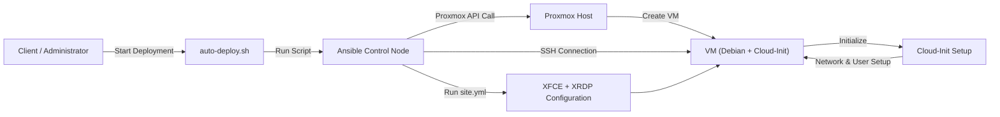
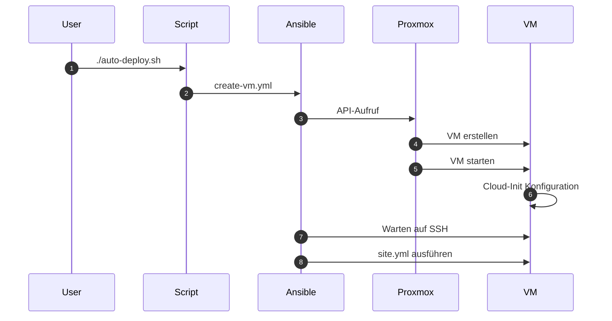
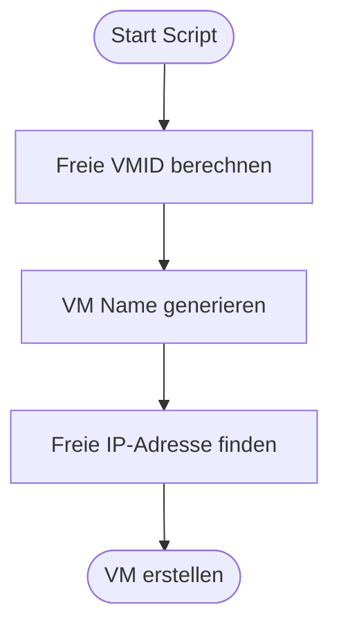
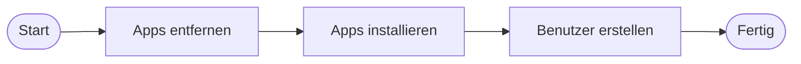

# 📄 **Automatisierung von virtuellen Maschinen mit Proxmox und Ansible**

----------

# **1. Einleitung**

Im Rahmen dieses Projekts wurde eine Lösung zur automatisierten Erstellung und Konfiguration von virtuellen Maschinen (VMs) entwickelt.

Die Umsetzung basiert auf den Technologien **Proxmox**, **Ansible**, **Cloud-Init** sowie **Shell-Skripten**. Ziel ist es, den gesamten Prozess – von der Erstellung bis zur fertigen Desktop-Umgebung – vollständig zu automatisieren.

Dies ermöglicht:

-   eine erhebliche Zeitersparnis
-   eine Reduzierung von Fehlern
-   eine standardisierte und reproduzierbare Infrastruktur

----------

# **2. Projektziel**

Die wichtigsten Ziele des Projekts sind:

-   Automatisierte Erstellung von virtuellen Maschinen
-   Automatische Konfiguration von Desktop-Systemen (XFCE, XRDP)
-   Bereitstellung sofort einsatzbereiter Systeme
-   Minimierung manueller Eingriffe

# **3. Systemübersicht**

Die folgende Abbildung zeigt den automatisierten Ablauf des Systems:

**Abbildung 1: Gesamtübersicht des Systems**

Die Darstellung verdeutlicht den vollständigen Ablauf von der Erstellung bis zur Konfiguration der virtuellen Maschine.

----------

# **4. Ablauf des automatisierten Deployments**

**Abbildung 2: Ablauf des Deployments**

----------

# **5. Automatisierungslogik**

**Abbildung 3: Automatisierungslogik**

----------

# **6. Verwendete Dateien und deren Inhalt**

----------

## **6.1 Skript `auto-deploy.sh`**

Dieses Skript übernimmt die zentrale Steuerung des Deployments. Es ermittelt automatisch eine freie VMID sowie eine verfügbare IP-Adresse und startet anschließend das Hauptskript.

----------

## **6.2 Skript `full-deploy.sh`**

Dieses Skript führt die vollständige Erstellung und Konfiguration der virtuellen Maschine aus. Es ruft sowohl das Playbook zur VM-Erstellung als auch das Konfigurations-Playbook auf.

----------

## **6.3 Playbook `create-vm.yml`**

Dieses Playbook erstellt eine neue virtuelle Maschine aus einem vorhandenen Template und konfiguriert Cloud-Init.

Funktionen:

-   Klonen der VM aus einem Template
-   Konfiguration von Netzwerk und Benutzer
-   Starten der VM

----------

## **6.4 Inventory `inventory.ini`**

Das Inventory definiert die Zielsysteme für Ansible und enthält die notwendigen Verbindungsparameter.

----------

## **6.5 Playbook `site.yml`**

Dieses Playbook übernimmt die vollständige Konfiguration der virtuellen Maschine nach der Erstellung.

----------

## **6.6 Rolle `xfce_xrdp`**

Diese Rolle installiert und konfiguriert die Desktop-Umgebung sowie den Remote-Zugriff.

Funktionen:

-   Installation von Paketen
-   Erstellung von Benutzern
-   Einrichtung von XFCE
-   Konfiguration von XRDP

----------

# **7. Erweiterte Systemkonfiguration**

Im Rahmen der Konfiguration wurden zusätzliche Anpassungen vorgenommen:

## **7.1 Entfernung unnötiger Pakete**

Zur Optimierung des Systems wurden nicht benötigte Anwendungen entfernt.

## **7.2 Installation zusätzlicher Software**

Wichtige Tools wie `htop`, `net-tools` und `xrdp` wurden installiert.

## **7.3 Benutzerverwaltung**

Benutzer werden automatisiert erstellt und konfiguriert.

Funktionen:

Installation von Paketen
Erstellung von Benutzern
Einrichtung von XFCE
Konfiguration von XRDP

----------

## **Entfernen unerwünschter Apps**

-   libreoffice-*
-   atril*
-   exfalso*
-   parole
-   quodlibet
-   xfburn
-   firefox-esr*
-   xsane
-   kdeconnect
-   hv3

----------

## **Installation neuer Apps**

-   net-tools
-   htop
-   google-chrome
-   onlyoffice
-   xrdp

----------

## **Benutzer einrichten**

-   Benutzer erstellen
-   Gruppen zuweisen
-   Desktop vorbereiten

**Abbildung 4: Erweiterte Konfiguration**

----------

# **7. Ergebnis**

./auto-deploy.sh

👉 erstellt automatisch eine fertige VM.

----------

# **9. Fazit**

Das Projekt zeigt, dass durch Automatisierung eine effiziente Infrastruktur aufgebaut werden kann.

Der gesamte Prozess ist:

-   automatisiert
-   reproduzierbar
-   skalierbar

# **7. Durchführung und Ergebnisse**

## **7.1 Start des Deployments**

**Abbildung 5: Ausführung des Deployments**

Die Ausgabe zeigt, dass alle Aufgaben erfolgreich ausgeführt wurden (failed=0).

----------

## **7.2 Erstellung der VM in Proxmox**

**Abbildung 6: VM in Proxmox**

Die VM wurde erfolgreich erstellt und gestartet.

----------

## **7.3 SSH-Verbindung**

**Abbildung 7: SSH-Verbindung**

Die Verbindung bestätigt die korrekte Netzwerkkonfiguration.

----------

## **7.4 Desktop-Umgebung**

**Abbildung 8: XFCE Desktop**

Die VM ist vollständig nutzbar.

----------

## **7.5 Remote Zugriff (XRDP)**

**Abbildung 9: Remote Desktop Verbindung**

Der Zugriff funktioniert über XRDP.

