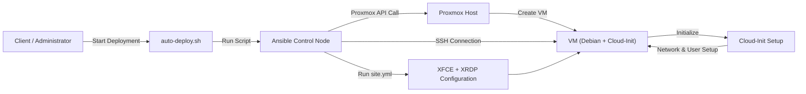
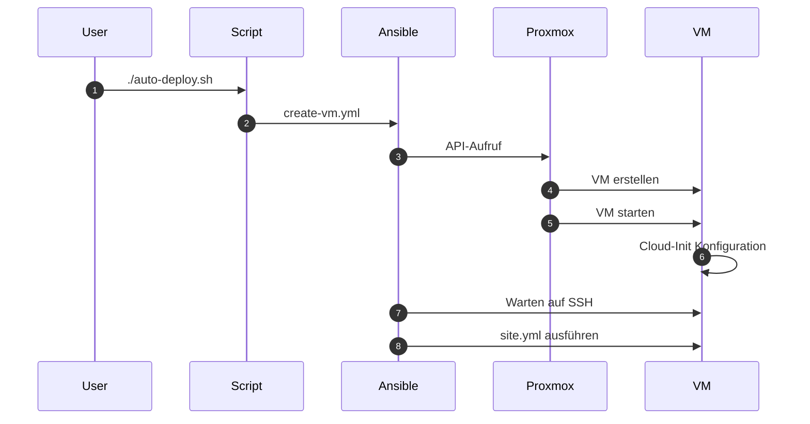

# 📄 **Automatisierung von virtuellen Maschinen mit Proxmox und Ansible**

----------

# **1. Einleitung**

Im Rahmen dieses Projekts wurde eine Lösung zur automatisierten Erstellung und Konfiguration von virtuellen Maschinen (VMs) entwickelt.

Die Umsetzung basiert auf den Technologien **Proxmox**, **Ansible**, **Cloud-Init** sowie **Shell-Skripten**. Ziel ist es, den gesamten Prozess – von der Erstellung bis zur fertigen Desktop-Umgebung – vollständig zu automatisieren.

Dies ermöglicht:

-   eine erhebliche Zeitersparnis
-   eine Reduzierung von Fehlern
-   eine standardisierte und reproduzierbare Infrastruktur

----------

# **2. Projektziel**

Die wichtigsten Ziele des Projekts sind:

-   Automatisierte Erstellung von virtuellen Maschinen
-   Automatische Konfiguration von Desktop-Systemen (XFCE, XRDP)
-   Bereitstellung sofort einsatzbereiter Systeme
-   Minimierung manueller Eingriffe

# **3. Systemübersicht**

Die folgende Abbildung zeigt den automatisierten Ablauf des Systems:

**Abbildung 1: Gesamtübersicht des Systems**

Die Darstellung verdeutlicht den vollständigen Ablauf von der Erstellung bis zur Konfiguration der virtuellen Maschine.

----------

# **4. Ablauf des automatisierten Deployments**

**Abbildung 2: Ablauf des Deployments**

----------

# **5. Automatisierungslogik**

**Abbildung 3: Automatisierungslogik**

----------

# **6. Verwendete Dateien und deren Inhalt**

----------

## **6.1 Skript `auto-deploy.sh`**

#!/usr/bin/env bash  
set  -e  
  
START_IP=168  
END_IP=199  
  
VMID=$(python3 ...)  
VM_NAME=$(printf "vm-%02d" $((VMID % 100)))  
  
for i in $(seq "$START_IP"  "$END_IP"); do  
  IP="192.168.30.$i"  
  if ! ping  -c  1  -W  1  "$IP"; then  
  VM_IP="$IP"  
 break  
  fi  
done  
  
./full-deploy.sh "$VMID"  "$VM_NAME"  "$VM_IP"

Dieses Skript berechnet automatisch VMID und IP und startet das Deployment.

----------

## **6.2 Skript `full-deploy.sh`**

VMID="$1"  
VM_NAME="$2"  
VM_IP="$3"  
  
ansible-playbook create-vm.yml \  
  -e  "vmid=$VMID vm_name=$VM_NAME vm_ip=$VM_IP"  
  
ansible -m  ping  
  
ansible-playbook site.yml

 Führt die komplette Erstellung und Konfiguration aus.

----------

## **6.3 Playbook `create-vm.yml`**

- name: Neue VM aus Template erstellen  
 hosts: localhost  
  
 tasks:  
 - name: VM klonen  
 community.proxmox.proxmox_kvm:  
 clone: "{{ template_name }}"  
 name: "{{ vm_name }}"  
 newid: "{{ vmid }}"  
  
 - name: Cloud-Init konfigurieren  
 community.proxmox.proxmox_kvm:  
 vmid: "{{ vmid }}"  
 ipconfig:  
 ipconfig0: "ip={{ vm_ip }}/24"  
  
 - name: VM starten  
 community.proxmox.proxmox_kvm:  
 vmid: "{{ vmid }}"  
 state: started

 Erstellt und startet die VM.

----------

## **6.4 Inventory `inventory.ini`**

[desktop_vms:vars]  
ansible_user=admin  
ansible_ssh_private_key_file=/root/.ssh/id_ed25519  
  
[desktop_vms]  
vm-06 ansible_host=192.168.30.172

Definiert die Zielsysteme.

----------

## **6.5 Playbook `site.yml`**

- name: Desktop-VM konfigurieren  
 hosts: desktop_vms  
 become: true  
  
 pre_tasks:  
 - wait_for_connection:  
  
 roles:  
 - xfce_xrdp

Startet die Konfiguration.

----------

## **6.6 Rolle `xfce_xrdp`**

- name: Pakete installieren  
 apt:  
 name: "{{ base_packages }}"  
  
- name: Benutzer erstellen  
 user:  
 name: "{{ item.name }}"  
  
- name: XRDP starten  
 service:  
 name: xrdp

Richtet Desktop und Remote-Zugriff ein.

----------

# **6.7 Erweiterte Systemkonfiguration**

----------

## **Entfernen unerwünschter Apps**

-   libreoffice-*
-   atril*
-   exfalso*
-   parole
-   quodlibet
-   xfburn
-   firefox-esr*
-   xsane
-   kdeconnect
-   hv3

----------

## **Installation neuer Apps**

-   net-tools
-   htop
-   google-chrome
-   onlyoffice
-   xrdp

----------

## **Benutzer einrichten**

-   Benutzer erstellen
-   Gruppen zuweisen
-   Desktop vorbereiten

**Abbildung 4: Erweiterte Konfiguration**

----------

# **7. Ergebnis**

./auto-deploy.sh

👉 erstellt automatisch eine fertige VM.

----------

# **9. Fazit**

Das Projekt zeigt, dass durch Automatisierung eine effiziente Infrastruktur aufgebaut werden kann.

Der gesamte Prozess ist:

-   automatisiert
-   reproduzierbar
-   skalierbar

# **7. Durchführung und Ergebnisse**

## **7.1 Start des Deployments**

**Abbildung 5: Ausführung des Deployments**

Die Ausgabe zeigt, dass alle Aufgaben erfolgreich ausgeführt wurden (failed=0).

----------

## **7.2 Erstellung der VM in Proxmox**

**Abbildung 6: VM in Proxmox**

Die VM wurde erfolgreich erstellt und gestartet.

----------

## **7.3 SSH-Verbindung**

**Abbildung 7: SSH-Verbindung**

Die Verbindung bestätigt die korrekte Netzwerkkonfiguration.

----------

## **7.4 Desktop-Umgebung**

**Abbildung 8: XFCE Desktop**

Die VM ist vollständig nutzbar.

----------

## **7.5 Remote Zugriff (XRDP)**

**Abbildung 9: Remote Desktop Verbindung**

Der Zugriff funktioniert über XRDP.

----------

**Abbildung 10: Mehrere VMs**

(ansible-venv) root@ansible-control:~/proxmox-ansible# cat ~/proxmox-ansible/auto-deploy.sh

#!/usr/bin/env bash

set -e

  

FULL_DEPLOY="/root/proxmox-ansible/full-deploy.sh"

  

# ----- Proxmox API -----

PROXMOX_HOST="192.168.30.99"

PROXMOX_USER="root@pam"

PROXMOX_PASSWORD="12345678"

  

# ----- IP-Bereich -----

START_IP=168

END_IP=199

  

# Trouver le plus petit VMID libre à partir des vrais VMIDs Proxmox

VMID=$(python3 - << 'PY'

import json

import ssl

import urllib.parse

import urllib.request

  

host = "192.168.30.99"

user = "root@pam"

password = "12345678"

  

ctx = ssl._create_unverified_context()

base = f"https://{host}:8006/api2/json"

  

data = urllib.parse.urlencode({

"username": user,

"password": password

}).encode()

  

req = urllib.request.Request(f"{base}/access/ticket", data=data, method="POST")

with urllib.request.urlopen(req, context=ctx, timeout=30) as r:

ticket_data = json.load(r)["data"]

  

ticket = ticket_data["ticket"]

  

req = urllib.request.Request(

f"{base}/cluster/resources?type=vm",

headers={"Cookie": f"PVEAuthCookie={ticket}"}

)

with urllib.request.urlopen(req, context=ctx, timeout=30) as r:

items = json.load(r)["data"]

  

used_vmids = sorted(int(item["vmid"]) for item in items if "vmid" in item)

  

expected = 100

for vmid in used_vmids:

if vmid != expected:

print(expected)

break

expected += 1

else:

print(expected)

PY

)

  

if [ -z "$VMID" ]; then

echo "FEHLER: Kein freier VMID gefunden."

exit 1

fi

  

# Nom cohérent avec le VMID

VM_NAME=$(printf "vm-%02d" $((VMID % 100)))

  

# Trouver la plus petite IP libre

VM_IP=""

for i in $(seq "$START_IP" "$END_IP"); do

IP="192.168.30.$i"

if ! ping -c 1 -W 1 "$IP" >/dev/null 2>&1; then

VM_IP="$IP"

break

fi

done

  

if [ -z "$VM_IP" ]; then

echo "FEHLER: Keine freie IP gefunden."

exit 1

fi

  

echo "Neue VM wird erstellt:"

echo "Name: $VM_NAME"

echo "VMID: $VMID"

echo "IP: $VM_IP"

  

# ancienne host key éventuelle

ssh-keygen -f '/root/.ssh/known_hosts' -R "$VM_IP" >/dev/null 2>&1 || true

  

"$FULL_DEPLOY" "$VMID" "$VM_NAME" "$VM_IP"
